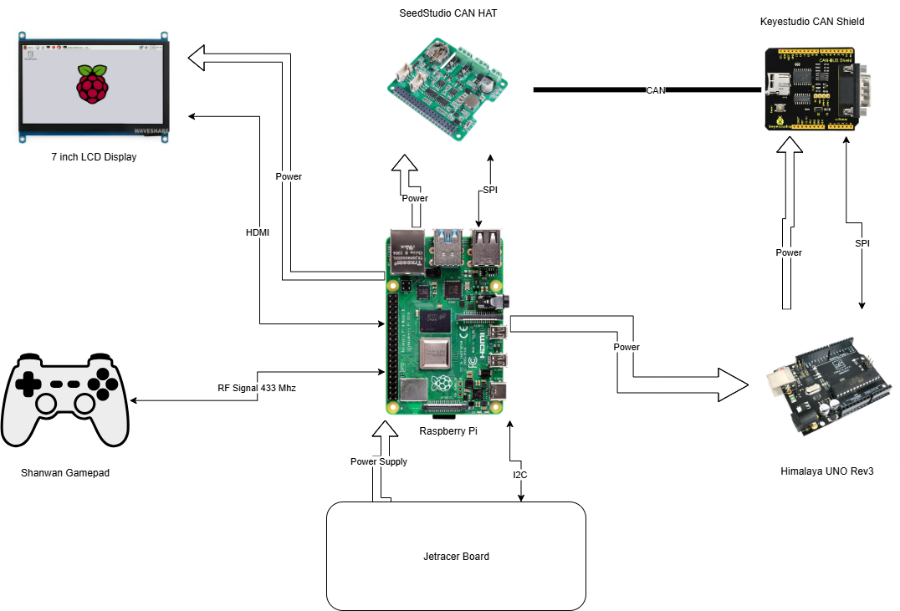

# DES Instrument Cluster

A hybrid Arduino and Python-based system for real-time sensor data acquisition, CAN bus communication, and dynamic instrument display. This project is designed for robotics applications, featuring battery monitoring and control via onboard OLED display.

## Architecture



## Features

- **Arduino Firmware**
  - Reads data from an Optocoupler Sensor.
  - Utilizes Timer Interrupts and CAN communication.
  - Sends sensor data to the CAN bus.

- **Python CAN Handler**
  - Creates a UNIX socket interface.
  - Reads messages from the CAN bus.
  - Forwards CAN messages to clients in JSON format.

- **Systemd Service**
  - Ensures Python scripts for robot control and battery display are started at boot.
  - Automates startup for reliable operation.

## Directory Structure

```
DES_Instrument-Cluster/
├── Arduino/
│   ├── main.ino
│   ├── timer_interrupt.h
│   └── can.h
├── Python/
│   └── CAN_Handler.py
├── Documentation/
│   └── architecture.png
├── systemd/
│   └── des_instrument.service
└── README.md
```

## Getting Started

### Prerequisites

- Arduino IDE and compatible hardware
- Python 3.7+
- Linux system with systemd
- CAN interface hardware (e.g., MCP2515)

### Installation

1. **Arduino Setup**
   - Upload the Arduino code in `Arduino/` to your device.
   - Ensure the timer and CAN headers are included.

2. **Python CAN Handler**
   - Install required Python packages (see `requirements.txt` if present).
   - Configure CAN interface on your system.

3. **Systemd Service**
   - Copy `systemd/des_instrument.service` to `/etc/systemd/system/`.
   - Enable and start the service:
     ```sh
     sudo systemctl enable des_instrument
     sudo systemctl start des_instrument
     ```

### Usage

- On boot, the systemd service will start the Python scripts for robot control and battery display.
- Arduino firmware will continuously read sensor data and send messages over CAN bus.
- Python CAN Handler will relay CAN messages to connected clients in JSON format.

## Contributing

Pull requests are welcome! If you have suggestions for improvements, please open an issue or contact the maintainers.

## License

This project is licensed under the MIT License. See the [LICENSE](LICENSE) file for details.

## Authors

- [SkySom13](https://github.com/SkySom13)

---

*For questions or support, open an issue in this repository.*
